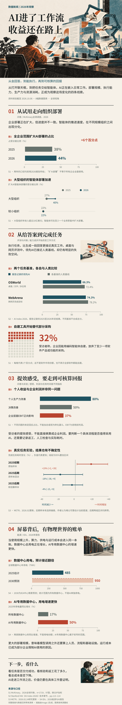

# AI进了工作流，收益还在路上

2026-10-06制作的完整数据新闻长图样例，按“组织部署 → 执行任务 → 实际回报 → 能源成本”推进。4个章节、8幅数据图表、4幅独立Image-2插画；结尾提出在具体任务中记录交付成功、核验返工与总成本。

## 验证状态

**`AWAITING_CANVA_VALIDATION`**。已完成本地高清渲染、逐章与关键位置100%/200%检查、PPTX单页与对象核验、关键数据的编码几何读回、第一方PPTX导入检查。当前浏览器自动上传被文件URL权限限制阻止；尚未验证这份完整作品在可画中国版的字体、编辑与正式导出。

之前骑行小样的可画验收结果不适用于本作品。PPTX中的图表是独立形状，不是数据表联动图表；SVG含独立位图插画，是混合母版，不是纯矢量图。

## 文件

- [高清PNG](AI进了工作流-高清长图.png)：2160×12420，一张连续图片。
- [SVG母版](AI进了工作流-长图.svg)：viewBox 1024×5888，真实文字和精确数据几何，内嵌位图插画。
- [可画单页导入PPTX](AI进了工作流-可画单页导入.pptx)：统一等比例适配为约890.435×5120工作像素，1页，145个文字对象、4个图片对象。
- [数据与来源](数据与来源.json)、[正文](正文与来源.md)、[对象清单](objects.json)：锁定原始值、统计范围、计算与图层。
- [插画原始提示词](image_prompts.json)与`assets/`：内置生图工具、4次独立生成。
- [测试记录](测试记录.md)、[本地机器可读验证](local-validation.json)：实际通过项、未完成项、文件哈希。

## 来源

采用[McKinsey 2026全球AI问卷](https://www.mckinsey.com/capabilities/quantumblack/our-insights/the-state-of-ai)、[Stanford HAI AI Index 2026技术章节](https://hai.stanford.edu/assets/files/ai_index_report_2026_chapter_2_technical.pdf)、[METR 2026.02研究更新](https://metr.org/blog/2026-02-24-uplift-update/)与[IEA 2026能源与AI报告](https://www.iea.org/reports/key-questions-on-energy-and-ai/executive-summary)。统计时期按图标注；问卷自报、任务评测与实验分别解释；不同问题不加总；2030用电为预测。

资料截至2026-10-06。样例数据是该时点的锁定输入，不能自动代表将来的最新情况，复用时重新核验。

